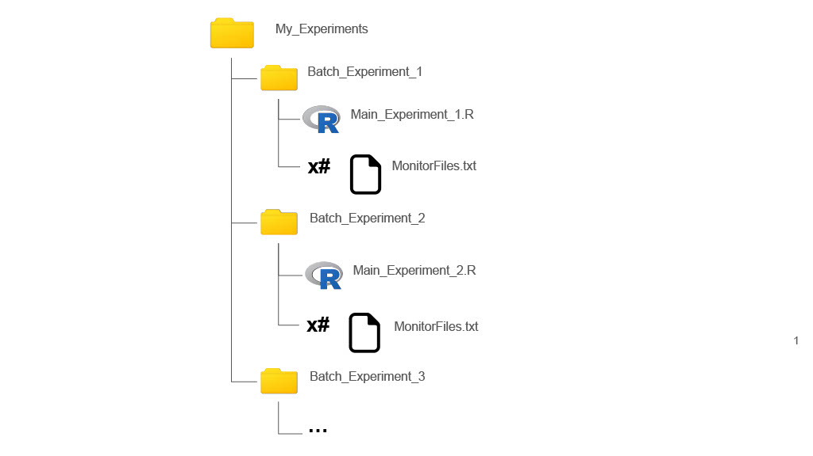

```{r setup, include=FALSE, cache=FALSE}
knitr::opts_chunk$set(echo = FALSE)
```


[Github Page](https://github.com/WanheLiLab/gigem)

[Li Lab Page](https://wanheli2022.wixsite.com/wanheli)

Created by Esther Doria, Wanhe Li, & Daniel Nguyen August 2024

Copyright (C) year-range Full Names

Contact: [estheridoria\@gmail.com](mailto:estheridoria@gmail.com){.email}

## 0. Installation

Install and attach devtools which can install gigem
```{Main echo = TRUE}
install.packages("devtools")
library(devtools)
```

Install and attach gigem
```{Main echo = TRUE}
install_github('Wanhelilab/gigem')
library(gigem)
```

Install the example data to use as a template (or copy the information from this file into a new script).
```{Main echo = TRUE}

```


## 1. Experimental Parameters: Creating a 'Main.R' File
Create a folder which will be your parent directory. 

Create folders inside that parent directory equal to the number of experiments (Batches) you ran. These will be your sub-directory folders. Each sub-directory folder should be named 'Batch' followed by any combination of letters, numbers and/or underscores, effectively labeling the experiment you ran. 

Create an R script within each sub-directory, naming it 'Main' followed by the same experimental label used for the sub-directory folder. 

Add the 'monitor.txt' files corresponding to each experimental batch into their respective sub-directory folders.




### 1.1 Monitor Specifications

Within each Main file, name the `Title` the same as the sub-directory folder containing it.

```{Main echo = TRUE}
# Title for data analysis.
Title="Batch..."

```

The variable `file` refers to the particular files generated by the Drosophila Activity Monitor (DAM) System (these should be full of 1s and 0s). Add the names of the monitor files generated in *your* experiment to replace the example ones below. 

```{Main echo = TRUE}
# Create a data table 'info' to store details of the monitoring setup
info <- data.table::data.table(
  
  # Filename associated with each monitor data
  file = rep(c("Monitor33.txt", "Monitor17.txt",
               "Monitor39.txt","Monitor35.txt",
               "Monitor55.txt", "Monitor57.txt",
               "Monitor13.txt","Monitor52.txt"), each = 32),
  
```

Add the corresponding monitor numbers to the `monitor` variable in the same order, preceded by 'M'. 

```{Main echo = TRUE}
  # Monitor identifier
  monitor = rep(c("M33","M17",
                  "M39","M35",
                  "M55","M57",
                  "M13","M52"), each = 32 ),

```

Throughout this file, both `region_id` and the term `each = 32` signifies the number of flies each DAM monitor holds. If your monitor holds more or fewer flies than 32, you will need to change this number for each of the variables.

```{Main echo = TRUE}
  # Unique numerical identifier for each arena within the DAM
  region_id = 1:32,

```         

### 1.2 `OK` or `notOK` Status
 
The standard `status` of each fly is "OK". See section 1.6 to manually change the `status` of certain flies and, consequently, omit them from analysis

```{Main echo = TRUE}
  # Status of the data (e.g., "OK")
  status = "OK",

```

### 1.3 Start/Stop Points

The `start_datetime` should be the first light-on time-point after the flies have been loaded into the monitor(s). The `stop_datetime` is the last light-on time-point (plus a few minutes) before removing them from the monitors. Typically, this will be between two to four Zeitgeber cycles (48-96 hours for a typical 24-hour cycle) from the `start_datetime` time-point. Please ensure that the time `stop_datetime` is a few minutes past the light-on time point; this will ensure none of the functions that deal with time are hindered (see section 2.3).

```{Main echo = TRUE} 
# Start datetime for monitoring period
  start_datetime = "2019-06-22 10:05:00",
  
  # Stop datetime for monitoring period
  stop_datetime = "2019-06-24 10:20:00",

```         

### 1.4 Organism Specifications

Match the `sex` and `genotype` of the flies to their respective monitors as listed above. For example, 

`file` = `Monitor33.txt` correlates to `monitor` = `M33`, `temp` = `21.5C`, `sex` = `M` (for male), `genotype` = `CS` and `treatment` = `Iso_2D`, `environment` = `"NA"`, `light` = `"12.12"` 

Therefore, the number of entries in each variable should be the same (excepting the ones where each monitor has the same variable attribute, as formatted in `start_datetime` or `sex`)

```{Main echo = TRUE}
 # Sex 
  sex = "M",
  
  # Genotypes
  genotype = rep(c("CS", "CS", 
                   "SIP-L2-3", "SIP-L2-3",
                   "SIP-L2-4", "SIP-L2-4", 
                   "SIP-L2-5", "SIP-L2-5"), each = 32),
  
```

### 1.5 Experimental Treatments

Specify any experimental treatments for each population such as social isolation, change in diet, sexual deprivation, etc..

```{Main echo = TRUE}
  # Temperature during monitoring
  temp = "21.5C",

# Treatment applied during monitoring period
  treatment = rep(c("Iso_2D","Grp_2D",
                    "Iso_2D","Grp_2D",
                    "Iso_2D","Grp_2D",
                    "Iso_2D","Grp_2D"),each = 32),

# Environmental factors
  environment = "NA",
  
# Light.Dark phases
  light = "12.12"
)

```         

### 1.6 Manually Excluding `notOK` flies.

Within certain cuvettes, you may see some factors that would interfere with your experimental results (ex. mold growth, or the incorrect sex). To remove this fly from analysis, change the following code to set the `monitor` equal to `'M'` followed by the monitor number of the compromised fly. Set the `regionID` equal to the arena number in that monitor that the fly inhabited during analysis. Finally, remove the `#` from before `info`. Repeat this process as necessary, adding a new line of code each time.

```{Main echo = TRUE}
# Change status manually to exclude cuvettes from analysis,
# info <- SetStatus(info, regionID=4, monitor="M33")
```      


## 2. Running the Package: Creating a HitRun.r File 

Create a new R script in the parent directory named "HitRun.R". In this file, enter all of the following script excepting optional sections that you do not want.

### 2.1 Set the Environment (No Editing Necessary)

Ensure the Library is loaded and set the working directory.

```{Main echo = T}
# Attach gigem to the path
library(gigem)

# Set working directory to the folder this HitRun.R file is within (which should be the parent directory)
parent_dir <- dirname(rstudioapi::getSourceEditorContext()$path)
setwd(parent_dir)

```

### 2.2 Set Plot Parameters

The variables that are selected for this vector of `divisions` will directly impact how the plots are divided (faceted). In this example, `sex` makes the `Sleep plot` and `Point plot` show two side-by-side plots where one side shows the `M(ales)` and the other shows the `F(emales)`.

`Sleep plot` refers to the mean circadian plots that are produced while `Point plot` refers to the mean quantified sleep and bouts plots. 

```{Main echo = T}
# Determine which variables to divide the plots by:
  # (e.g. temp, sex, genotype, treatment, environment, or light)
divisions<- c("treatment",            # 1: Sleep plot, overlay and color
              "sex",                  # 2: Sleep plot, rows
              "genotype",             # 3: Sleep plot, columns
              "treatment",            # 4: Point plot, x-axis and color
              "sex",                  # 3: Point plot, rows
              "genotype")             # 6: Point plot, columns

```

### 2.3 

Decide the number of days you wish to analyze from the experiment. This should be less than the number of days between `start_datetime` and `stop_datetime`. 

```{Main echo = T}
# Set the number of days you wish to analyze
num_days = 2

```

### 2.4 Run the Batches

This is the main function of gigem. 

List a `genotype` and `treatment` which will serve as your controls.  

```{Main echo = T}
# Run the Analysis
runAllBatches(controlgeno = "CS", controltreat = "Grp")

```

### 2.5 Plot a correlation matrix (optional)

Select two `treatment` groups to compare in any order.

```{Main echo = T}
# Plot correlation matrix (optional)
corMat(Compare1 = "Grp_2D", Compare2 = "Iso_2D")
corMat(Compare1 = "Grp_5D", Compare2 = "Iso_5D")

```

### 2.6 Plot kmeans sleeploss Clusters with groupings (optional)

Select two `treatment` groups to compare with the control listed as `Compare1`. 

If you have hypothesized similarities, list the common denominators in `groupings` with the variable that common denominator is in in `column_name` (number of `groupings` is restricted to one or more entries). For example, the variable `genotype` has many entries, but I suspect the ones with "L1" in their names are similar to each other. Likewise with "L2", "S1", "S2" and "CS". Any entries in the designated `column_name` variable that do not match a specified `grouping` will be grouped together into an "NA" grouping. 

The plot will show the actual similarity of monitors while indicating the `groupings` hypothesized.

Repeat with different variables as necessary.

```{Main echo = T}
# Plot cluster groups for 2 days and 5 days (optional)
kmeansCluster(Compare1 = "Grp_5D", Compare2 = "Iso_5D", 
              groupings = c("L1", "L2", "S1", "S2", "CS"), column_name = "genotype")
kmeansCluster(Compare1 = "Grp_2D", Compare2 = "Iso_2D", 
              groupings = c("L1", "L2", "S1", "S2", "CS"), column_name = "genotype")

```

### 2.7 Plot Comparable Normalized sleeploss

Decide which `treatment`(s) you want to plot the sleeploss of with the most extreme `treatment` first. These must be different from what `controltreat` was set to (see section 2.4) as that is what is used to calculate the normalized values. Only one `treatment` is necessary.

Designate a column_name, a variable from the 'Main.R' file, which serves as the x-axis of the produced plot. 

Designate a `Control` from within the variable `column_name`.

Each unique combination of `treatment` and `column_name` entries have been previously normalized to the `controltreat` and `controlgeno` from the same Batch, so the subsequent plot contains these attributes as well. 

```{Main echo = T}
# Plot normalized sleep loss for the variable desired (optional)
normDisplay(treat = "Iso_5D", treat2 = "Iso_2D", column_name = "genotype", Control = "CS")
```


