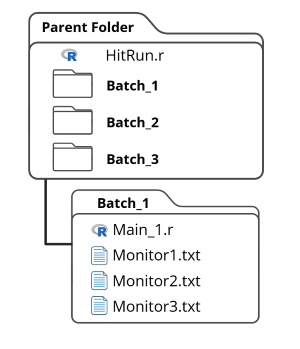
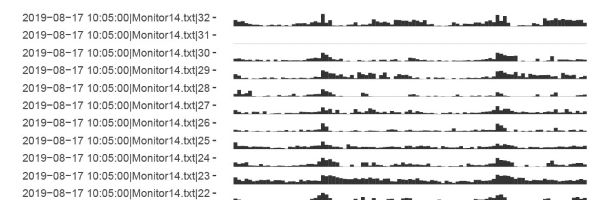
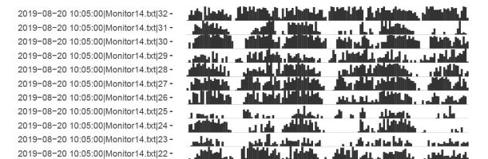
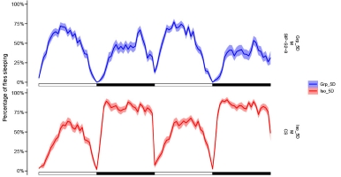
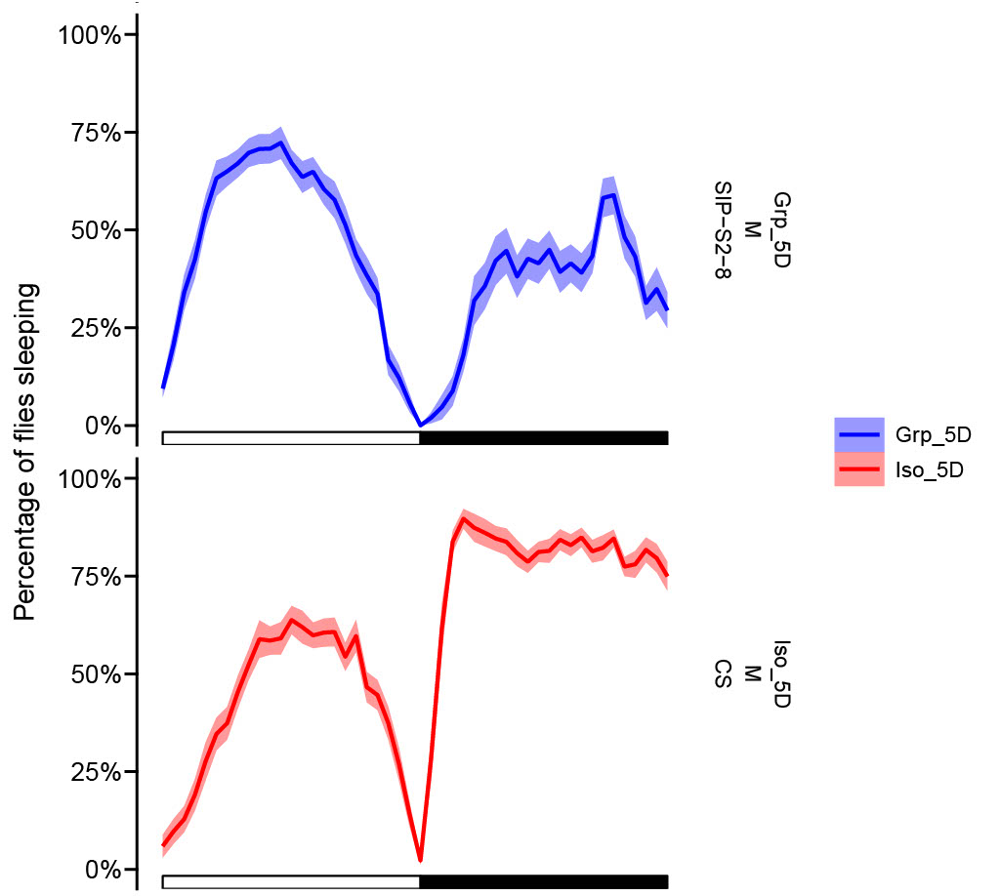
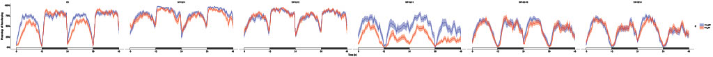
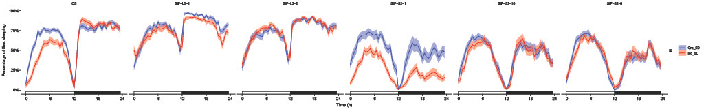
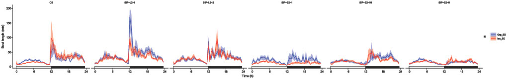
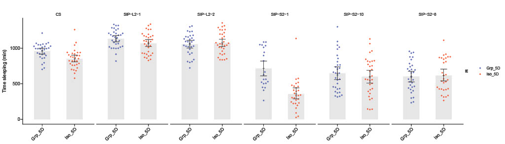
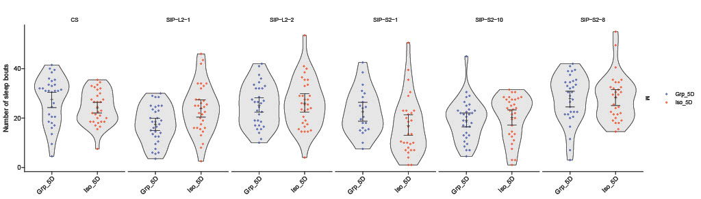

README
================
2025-11-11

[Github Page](https://github.com/estheridoria/gigem)

[Li Lab Page](https://wanheli2022.wixsite.com/wanheli)

Created by Esther Doria & Wanhe Li December 2025

Copyright (C) 2025-Present Esther Doria & Wanhe Li

Contact: <estheridoria@gmail.com>
## gigem: Group Isolation Gauge Effect Metrics

The `gigem` package provides a comprehensive pipeline for processing raw **Drosophila Activity Monitor (DAM)** data. It includes functions for data cleaning, dead fly removal, generating summary statistics, and producing publication-quality plots across single or multiple experimental batches.

## 0. Installation and Example Data

### 0.1 Install gigem

Install the `devtools` package in your R terminal then use it to install `gigem` directly from GitHub:

```main
install.packages("devtools")
library(devtools)
install_github('estheridoria/gigem')
library(gigem)
```
* note: if you encounter an error, install Rtools from https://cran.r-project.org/bin/windows/Rtools/

### 0.2 Download the template files (optional if downloading example data)

Run the code below to copy the necessary template files (HitRun.R and Main.R) into your current working directory:

Alternatively, manually copy and paste the code from section 5 into two
separate files.

``` main
# Download "HitRun.R" & "Main.r" template files
download.file("https://github.com/estheridoria/gigem/releases/download/v0.9.0/gigem_templates.zip",
  destfile = "gigem_templates.zip")
```

### 0.3 Download example or full SIP analysis (optional)

To explore the package capabilities with example data, download the repository into a subdirectory named "ExampleAnalysis" (optional).

``` main
# Download example analysis
download.file("https://github.com/estheridoria/gigem/releases/download/v0.9.0/ExampleAnalysis.zip",
  destfile = "ExampleAnalysis.zip")
```
``` main
# Download full SIP analysis
download.file("https://github.com/estheridoria/gigem/releases/download/v0.9.0/FullSIPAnalysis.zip",
  destfile = "FullSIPAnalysis.zip")
```

## 1. Experimental Parameters: Creating a ‘Main.R’ File

Create a folder which will be your parent directory.

The directory structure and metadata file are critical for the pipeline to function correctly.

1.  **Parent Directory:** Start in a folder that will serve as your parent directory.
2.  **Batch Folders:** Create sub-directories for each experiment, named `Batch` followed by an alphanumeric label (e.g., `Batch_Exp`).
3.  **`Main.R`:** Place an R script named `Main*.R` (e.g., `Main_Exp1.R`) and the corresponding raw **`monitor.txt`** files inside each Batch sub-directory.

<figure>

<figcaption aria-hidden="true">Directory Layout</figcaption>
</figure>
### 1.1 Monitor Specifications

Within each `Main*.R` file, you must define a `data.table` named `info` containing all experimental factors including the `Batch` name.

``` main
# Create a data table 'info' to store details of the monitoring setup
info <- data.table::data.table(

# Title for data analysis.
Batch ="..."
```

The variable `file` refers to the particular files generated by the
Drosophila Activity Monitor (DAM) System (these should be full of 1s and
0s). Add the names of the monitor files generated in *your* experiment
to replace the example ones below. Throughout this file, both `region_id` and the term `each = 32`
signifies the number of flies each DAM monitor holds. If your monitor
holds more or fewer flies than 32, you will need to change this number
for each of the experimental factors.

``` main
# Create a data table 'info' to store details of the monitoring setup
info <- data.table::data.table(
  
  # Filename associated with each monitor data
  file = rep(c("Monitor22.txt", "Monitor7.txt",
               "Monitor14.txt", "Monitor3.txt",
               "Monitor15.txt", "Monitor39.txt",
               "Monitor53.txt", "Monitor27.txt",
               "Monitor52.txt", "Monitor17.txt",
               "Monitor21.txt", "Monitor50.txt"), each = 32),
               
  # Unique numerical identifier for each arena within the DAM
  region_id = 1:32,
```

### 1.2 `OK` or `notOK` Status

The standard `status` of each fly is “OK”. See section 1.6 to manually
change the `status` of certain flies and, consequently, omit them from
analysis

``` main
  # Status of the data (e.g., "OK")
  status = "OK",
```

### 1.3 Start/Stop Points

The `start_datetime` should be the first light-on time-point after the
flies have been loaded into the monitor(s). The `stop_datetime` is the
last light-on time-point (plus an  hour) before removing them from
the monitors. Typically, this will be between two to four Zeitgeber
cycles (48-96 hours for a typical 24-hour cycle) after the
`start_datetime` time-point. Please ensure that the time `stop_datetime`
is an hour past the light-on time point; this will ensure none of
the flies are mistakenly considered dead during a sleep bout at the end of the last day.

``` main
  # Start date and time of the monitoring period
  start_datetime = "2019-08-17 10:00:00",
  
  # Stop date and time of the monitoring period
  stop_datetime = "2019-08-19 11:00:00",
```

### 1.4 Experimental Factors: Organism Specifications

Match the `sex` and `genotype` of the flies to their respective monitors
as listed above. For example,

`file` = `Monitor22.txt` correlates to `Sex` = `M` (for male), `Genotype` = `SIP-L2-2`, `Temperature` = `21.5C`, `Treatment` =
`Iso_2D`, `Environment` = `"Vial"`, `Light` = `"12:12"`

Therefore, the number of entries in each variable should be the same
(excepting the ones where each monitor has the same variable attribute,
as formatted in `start_datetime` or `Sex`)

``` main
 # Sex 
  Sex = "M",
  
  # Genotypes
  Genotype = rep(c("SIP-L2-2", "SIP-L2-2",
                   "SIP-S2-8", "SIP-S2-8",
                   "SIP-S2-1", "SIP-S2-1",
                   "CS", "CS",
                   "SIP-S2-10", "SIP-S2-10",
                   "SIP-L2-1", "SIP-L2-1"), each = 32),
```

### 1.5 Experimental Factors: Experimental Treatments

Specify any experimental treatments for each population such as social
isolation, change in diet, sexual deprivation, etc..

``` main
# Temperature during monitoring
Temperature = "21.5C",

# Treatment applied during monitoring period
Treatment = rep(c("Iso_2D", "Grp_2D",
                    "Iso_2D", "Grp_2D",
                    "Iso_2D", "Grp_2D",
                    "Iso_2D", "Grp_2D",
                    "Iso_2D", "Grp_2D",
                    "Iso_2D", "Grp_2D"), each = 32),

# Environmental factors
  Environment = "NA",
  
# Light.Dark phases
  Light = "12.12"
)
```

### 1.6 Manually Excluding `notOK` flies.

Within certain cuvettes, you may see factors that would interfere
with your experimental results (mold growth, the incorrect sex, etc.).
To remove this fly from the analysis, change the following code to set the
`file` equal to `monitorXX.txt` to indicate which monitor the compromised fly was in. Set the `regionID` equal to the arena number the fly inhabited within that
monitor. Finally, remove the `#`
from before `info`. Repeat this process as necessary, adding a new line
of code each time.

``` main
# Change status manually to exclude cuvettes from analysis,
# info <- SetStatus(info, regionID=4, file="monitor33.txt")
```

## 2. Running the Package

Create a new R script in the parent directory named “HitRun.R”. In this
file, enter all of the following script excepting the optional sections
you do not want.

### 2.1 Set the Environment

Ensure the Library is loaded and set the working directory by running this code.
``` main
# Attach gigem to the path
library(gigem)

# Set working directory to the folder this HitRun.R file is within (which should be the parent directory)
parent_dir <- dirname(rstudioapi::getSourceEditorContext()$path)
setwd(parent_dir)
```

### 2.2 Run All or One Experimental Batch(es)

These are the main functions of gigem. 

For analyzing a single batch:
``` main
# Run the Analysis
runOneBatch(oneBatch = "Batch9_2Days", numDays = 2, 
              overlayVar = "Treatment", rowVar = "Sex", columnVar = "Genotype", 
              plotSelection = "All", font = "bold", pValues = TRUE)
```

For analyzing multiple batches simultaneously:
``` main
# Run the Analysis
runAllBatches(numDays = 2, 
              overlayVar = "Treatment", rowVar = "Sex", columnVar = "Genotype", 
              plotSelection = "All", font = "bold", pValues = TRUE)
```

#### 2.2.1 Set oneBatch (if running runOneBatch)

Set `oneBatch` to the same name as the sub-directory folder containing the experiment of interest
``` main
oneBatch = "Batch9_2Days"
```

#### 2.2.2 Define Length of Analysis

Decide the number of days you wish to analyze from the experiment. This
should be equal to or less than the number of days between `start_datetime` and
`stop_datetime`.
``` main
numDays = 2
```

#### 2.2.3 Select Plot Outputs

Decide if you want `All`, `None`, or `Select` plots generated within each batch.
``` main
plotSelection = "All"
```

#### 2.2.4 Partition Output Plots

Determine which experimental factors to partition the plots by. (See section 3 for reference)

Conditions within `Treatment` will each have a different color and will be superimposed in "overlay" plots

``` main
overlayVar = "Treatment"
```

`M(ales)` and `F(emales)` will be separated to show Males in the bottom row of the plots and Females in the top row.

``` main
rowVar = "Sex"
```

Different `Genotypes` will be placed side-by-side in different columns.

``` main
columnVar = "Genotype",
```

#### 2.2.5 Set Font

The default is `"plain"`, but options include `"plain"`, `"bold"`, `"italic"`, and `"bold.italic"`.

``` main
font = "bold",
```

#### 2.2.6 Set pValues

Setting `pValues` to `TRUE` causes the plot *combinedPlots* to display *t*-test values. (This only applies when exactly 2 conditions exist within the `overlayVar` experimental factor.)

``` main
pValues = TRUE,
```

## 3. Run Multi-Batch Analysis Plots (optional)

If you run runAllBatches, you can generate further plots to analyze the relationship between conditions within your experimental factors and sleep parameters across the batches.

### 3.1 Plot rankedDisplay

This function produces a series of ranked bar plots to visualize either raw sleep values (min), change in sleep (`condition1` - `condition2`, min), or percentage of sleep change ([`condition1` - `condition2`] / `condition2`, %). The plots are automatically ranked based on the total sleep amounts. For change in sleep `method` is set to "Diff" while Perc.Change designates the percentage of sleep change, assuming `condition2` is the control.

`x` is set to an experimental factor, and (optionally) a `control` condition from within the selected experimental factor may be designated. 

`condition1` may be set to a condition within one of the non-`x` experimental factors. `condition2` should then be set to a control condition within the same non-`x` experimental factor. 

If the conditions are set, the `method` should be set to "Diff" for change in sleep or "Perc.Change" for percentage of sleep change. "Diff" is the default value when the conditions are set.

The plot data can be narrowed to include only particular conditions within the experimental factors by setting `treat`, `temp`, `enviro`, `sex`, `lights`, and/or `geno` to the desired condition(s). 

The output will produce a PDF as well as list the order of `x` condition in the *x*-axis after the x is arranged by ascending values. This output can be inputted into the variable `ranking` to impose the same x arrangement onto another produced rankedDisplay plot.

The variable `formula` refer to fitting the data to a linear model using the specified `formula` as an equation composed of Experimental factors and/or Batch (ex. "Genotype * Treatment + Batch"). Not specifying will not fit a linear model.

`font` may be set to `"plain"`, `"bold"`, `"italic"`, and `"bold.italic"` with "plain" as the default.

In this example, we produced two plots, one for the `Environment` "5D" and one for "2D", using the ranking from "5D" to order "2D".

``` main
rankedDisplayOrder <- rankedDisplay(x = "Genotype", control = "CS", condition1 = "Iso", condition2 = "Grp",
              enviro = "5D")
rankedDisplay(x = "Genotype", control = "CS", condition1 = "Iso", condition2 = "Grp",
              enviro = "2D", ranking = rankedDisplayOrder)
```

### 3.2 Plot a Correlation Matrix (optional)

This function produces a correlation matrix of seven sleep parameters: Sleep_Time_All, Sleep_Time_L, Sleep_Time_D, n_Bouts_L, mean_Bout_Length_L, n_Bouts_D, and mean_Bout_Length_D. Similarly to rankedDisplay, conditions, method, linear model and subsetting can be done. 

``` main
corMatrix(condition1 = "Iso", condition2 = "Grp", enviro = "2D")
```

### 3.3 Plot a Scatterplot Matrix with kmeans clustering & *a priori* groupings (optional)

A more thorough visualization of the Correlation Matrix may be seen in this scatterplot matrix. The arrangement of many scatterplots of each of the 7 previously mentioned parameters and their relationships with one another is displayed in the same order as the correlation matrix corrMatrix. 

Conditions, method, linear model and subsetting can be specified as with rankedDisplay and corrMatrix. Additionally, up to 10 conditions may be specified in `aPrioriConditions` with the column containing the conditions labeled in `aPrioriVariable`. If you suspect grouping together of specific subsects, this can visualize that potential grouping.

`aPrioriConditions` can be set to a portion of or whole word within one of the columns. For example, Genotype may contain animals SIP-L1-1, SIP-L1-2, and SIP-S1-3.
```main
`aPrioriConditions` = c(“L1”, “S1”), `aPrioriVariable` = "Genotype"
```
The above code will group the first two genotypes together by one color and the third genotype by another color.

Repeat with different variables as necessary. In this case, we produced scatter plots for 2 Days and 5 Days

``` main
# Plot scatterplots for 2 days and 5 days (optional)
corScatter(condition1 = "Iso", condition2 = "Grp", enviro = "2D",
              aPrioriConditions = c("L1", "L2", "S1", "S2", "CS"),
              aPrioriFactor = "Genotype", font = "bold")
              
corScatter(condition1 = "Iso", condition2 = "Grp", enviro = "5D",
              aPrioriConditions = c("L1", "L2", "S1", "S2", "CS"),
              aPrioriFactor = "Genotype", font = "bold")
```

## 4. Plots generated via plotSelection (see 2.2.3)

### 4.1 Sleep/Activity Profile

Should you set "`plotSelection` = `Select`", 6 or 7 prompts will appear sequentially in the console.
The user must type and enter ‘1’ or ‘2’ into the console to generate or not generate the particular plots. Below are
example plots for each of the questions.


Do you want to generate each monitor's 'Activity and Sleep Actograms'?

1: Yes 2: No

activity
 

sleep
 

### 4.2 Population Plots (full-length and 24-hour summary)

Do you want to generate 'Population Sleep Profiles'? (i.e. Each unique condition)

1: Yes 2: No

 


### 4.3 Population Overlay (full-length and 24-hour summary)

Do you want to generate 'Overlaid Sleep Profiles'? (i.e. Each condition overlaid according to your first entry in 'Divisions')

1: Yes 2: No

 
 

### 4.4 Batch-Grouped Sleep Bouts

Do you want to generate 'Overlaid Sleep Bout Profiles'?

1: Yes 2: No

 

### 4.5 Batch-Grouped Quantitative Point Plots

Do you want to generate 'Quantifications of Sleep Traits'?

1: Yes 2: No

 


### 4.6 Combined Plots for 'Overlaid Sleep Profiles (24Hr)' and 'Quantifications' (Within Batches)

Do you want to generate 'Combined Plots (Within Batches)'?(i.e. All plots grouped by unique combination of variable conditions)

1: Yes 2: No

.png) 

### 4.7 Combined Plots for 'Overlaid Sleep Profiles (24Hr)' and 'Quantifications' (Across Batches)
*Note: This prompt will only appear if you are running 'runAllBatches.'*

Do you want to generate 'Combined Plots (Across Batches)'? (i.e. All plots grouped by unique combination of variable conditions)

1: Yes 2: No

.png) 


## 5. Templates

### 5.1 “Main.R” template

``` main
# Set a title for the data analysis (this can be the batch name or other descriptor)
Title = "Batch9_2Days"

# ----------------------------------------------------------------------------
# Create a data table 'info' to store details of the monitoring setup

info <- data.table::data.table(
  
  # Filename associated with each monitor's data
  # "each" reflects the number of sensors per monitor in the array used;
  # In this case, there are 32 sensors per DAM monitor, each holding data for 32 flies
  file = rep(c("Monitor22.txt", "Monitor7.txt",
               "Monitor14.txt", "Monitor3.txt",
               "Monitor15.txt", "Monitor39.txt",
               "Monitor53.txt", "Monitor27.txt",
               "Monitor52.txt", "Monitor17.txt",
               "Monitor21.txt", "Monitor50.txt"), each = 32),
  
  # Unique identifier for each sensor region (range from 1 to 32)
  region_id = 1:32,
  
  # Data status (e.g., whether the data collection was successful, marked "OK")
  status = "OK",
  
  # Start date and time of the monitoring period
  start_datetime = "2019-08-17 10:00:00",
  
  # Stop date and time of the monitoring period
  stop_datetime = "2019-08-19 10:20:00",
  
  # Sex of the subjects being monitored (M = Male, F = Female)
  Sex = "M",
  
  # Genotype of the subjects being monitored (this is replicated for each group of flies)
  Genotype = rep(c("SIP-L2-2", "SIP-L2-2",
                   "SIP-S2-8", "SIP-S2-8",
                   "SIP-S2-1", "SIP-S2-1",
                   "CS", "CS",
                   "SIP-S2-10", "SIP-S2-10",
                   "SIP-L2-1", "SIP-L2-1"), each = 32),
  
  # Temperature during the monitoring period
  Temperature = "21.5C",
  
  # Treatment applied during monitoring period
  Treatment = rep(c("Iso","Grp",
                    "Iso","Grp",
                    "Iso","Grp",
                    "Iso","Grp",
                    "Iso","Grp",
                    "Iso","Grp"),each = 32),
  
  # Environment condition during the experiment (e.g., NA if not applicable)
  Environment = rep(c("2D", "2D",
                      "2D", "2D",
                      "2D", "2D",
                      "2D", "2D",
                      "2D", "2D",
                      "2D", "2D"), each = 32),
  
  # Light cycle during monitoring (e.g., light-dark cycle in hours)
  Light = rep(c("12:12", "12:12",
                "12:12", "12:12",
                "12:12", "12:12",
                "12:12", "12:12",
                "12:12", "12:12",
                "12:12", "12:12"), each = 32)
)
# ----------------------------------------------------------------------------

# Change status manually to exclude cuvettes from analysis,
# info <- SetStatus(info, regionID=4, monitor="M33")
```

### 5.2 “HitRun.R” example template

``` main
library(gigem)

parent_dir <- dirname(rstudioapi::getSourceEditorContext()$path)
setwd(parent_dir)

# Run the Analysis (one batch)
runOneBatch(oneBatch = "Batch9_2Days", numDays = 2,
            overlayVar = "Treatment", rowVar = "Sex", columnVar = "Genotype",
            font = "bold")

# Run the Analysis (all batches)
runAllBatches(numDays = 2,
              overlayVar = "Treatment", rowVar = "Sex", columnVar = "Genotype", 
              font = "bold", pValues = FALSE)

# Optional functions -----------------------------------------------------------

# Plot correlation matrix (optional)
  corMatrix(condition1 = "Iso",condition2 = "Grp",enviro = "2D",formula = "Genotype*Treatment + Batch")
  corMatrix(condition1 = "Iso",condition2 = "Grp",enviro = "5D",formula = "Genotype*Treatment + Batch")


# Plot cluster groups for 2 days and 5 days (optional)
  corScatter(condition1 = "Iso",condition2 = "Grp", enviro = "2D",formula = "Genotype*Treatment + Batch", aPrioriConditions = c("L1", "L2", "S1", "S2", "CS"),aPrioriVariable = "Genotype")
  corScatter(condition1 = "Iso",condition2 = "Grp", enviro = "5D",formula = "Genotype*Treatment + Batch", aPrioriConditions = c("L1", "L2", "S1", "S2", "CS"),aPrioriVariable = "Genotype")


# Plot normalized sleep loss for the variable desired (optional)
   rankedOrder<- rankedDisplay(x = "Genotype", condition1 = "Iso",condition2 = "Grp", enviro = "5D",formula = "Genotype*Treatment + Batch")
   rankedDisplay(x = "Genotype", condition1 = "Iso",condition2 = "Grp", enviro = "2D", ranking = rankedOrder, formula = "Genotype*Treatment + Batch")

```
